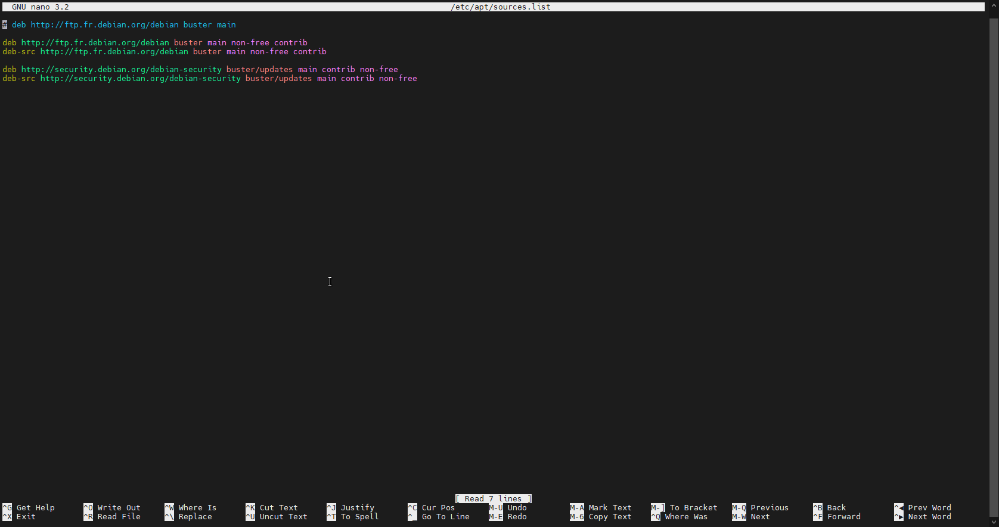

# Crée un contener LXC

1. Télécharger l'image que vous souhaitez

* Allez a l'endroit où est stocké vos iso et template (Par défaut dans local)

.png>)

* Puis dans CT Modèles -> Template

.png>)

* Selectionnez le template que vous souhaitez télécharger

.png>)

* Patienter le temps du téléchargement

.png>)

2\. Créer la machine

* Appuyez sur "Créer CT"

.png>)

* Rentrez le mot de passe SSH de la machine ou votre clé SSH, Puis configurer comme si vous configuriez une machine virtuel

&#x20;

.png>)

.png>)

.png>)

.png>)

.png>)

.png>)

.png>)

* Patienter un petit moment aprés appuyé sur Terminé

.png>)

* Et voila votre contener est en fonctionnement

.png>)
