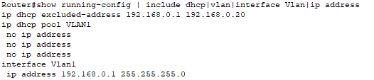
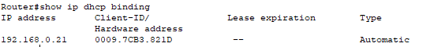
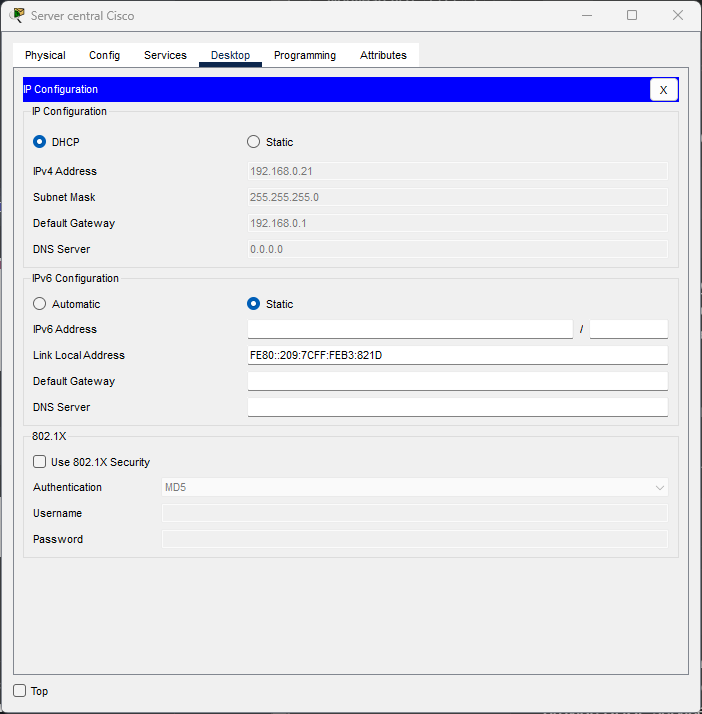

# Crée un serveur DHCP sur un routeur

## Prérequis

Avoir un VLAN D'actif sur le routeur et configuré[ (voir ici pour en faire un)](cree-un-vlan.md)

#### Configuration du Pool DHCP

Commencon la configuration de notre pool DHCP en excluant des adresse de notre réseau du pool DHCP (Cela nous permet d'avoir des IP non occupé pour nos apparail avec des IP Fixe pour éviter tout probléme de double attribution, même si DHCP sais le géré)

```
Router(config)# ip dhcp excluded-address <ip de début> <ip de fin si c'est une plage d'addresse>
```

Par exemple pour exclure uniquement `192.168.0.1` :&#x20;

```
Router(config)# ip dhcp excluded-address 192.168.0.1
```

Ou si comme moi, vous préférez vous garder certaine IP pour vos IP Fixes dans votre réseau (dans mon cas de `192.168.0.1` à `192.168.0.20` ) :&#x20;

```
Router(config)# ip dhcp excluded-address 192.168.0.1 192.168.0.20
```

Maintenant, nous allons configurer DHCP sur notre VLAN

<pre><code>Router(config)# ip dhcp pool VLAN&#x3C;n° de VLAN>
<strong>Router(dhcp-config)# network &#x3C;votre plage ip> &#x3C;masque de sous réseau>
</strong>Router(dhcp-config)# default-router &#x3C;votre gateway>
Router(dhcp-config)# dns-server &#x3C;vos dns> # vous n'êtes pas obligé d'en préciser un
Router(dhcp-config)# exit
</code></pre>

## (Si besoin) Activé le Trunking

Si vous voulez interconnecter plusieurs VLAN ou routeur/switch physiquement, vous devez activé le Trunking sur l'interface relier à votre VLAN

```
Router(config)# interface <votre interface>
Router(config-if)# switchport mode trunk
```

## Vérification

On peut vérifié le bon fonctionnement de notre serveur DHCP !

<pre><code><strong>Router# show running-config | include dhcp|vlan|interface Vlan|ip address
</strong></code></pre>

<figure><figcaption></figcaption></figure>

```
Router# show ip dhcp binding
```

<figure><figcaption></figcaption></figure>

<figure><figcaption></figcaption></figure>
