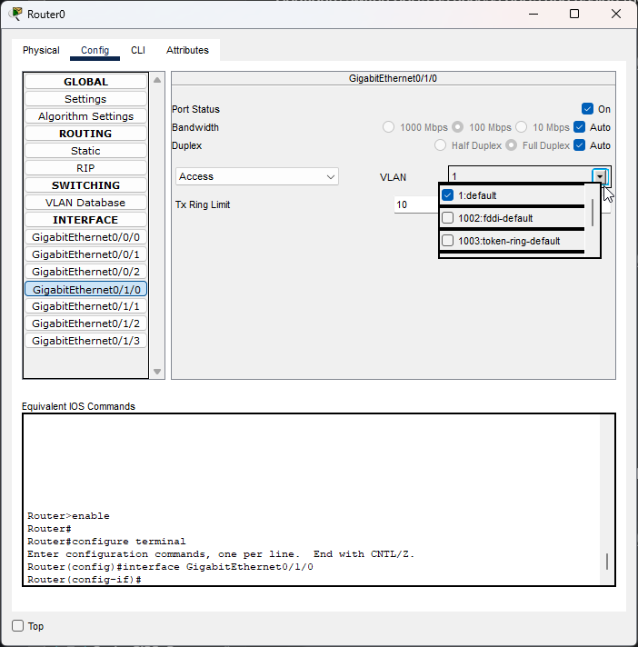
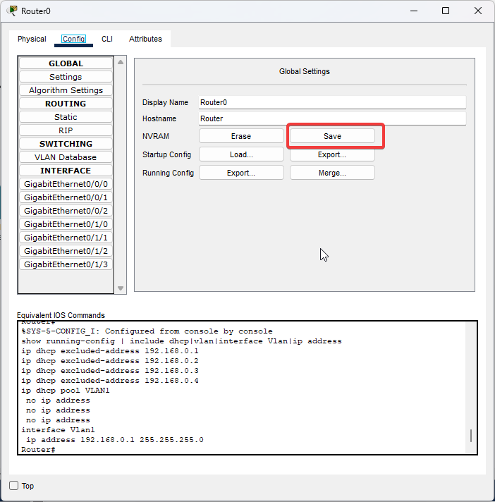

# Crée un VLAN

### Création du VLAN

<pre><code>Router> en
Router# config
Router(config)# vlan &#x3C;id de votre vlan>
Router(config-vlan)# name &#x3C;nom de votre vlan>
<strong>Router(config-vlan)# exit
</strong></code></pre>

Ici dans mon cas, cela sera

```
Router> en
Router# config
Router(config)# vlan 1
Router(config-vlan)# name default
Router(config-vlan)# exit
```

### Configuration de l'Interface VLAN

Dans un 1er temps, on va lui attribué une adresse IP, ce qui va d'ailleurs être notre gateway par défaut

```
Router(config)# interface vlan <id de votre vlan>
Router(config-if)# ip address <ip de votre gateway/réseau du vlan> <masque de sous réseau>
Router(config-if)# no shutdown
```

Ici dans mon cas, cela sera

```
Router(config)# interface vlan 1
Router(config-if)# ip address 192.168.0.1 255.255.255.0
Router(config-if)# no shutdown
```

### (Optionel) Configurer la gateway du Routeur

Cela peut être utilise si le routeur à besoin de parler HORS de son réseau

```
Router(config)# ip default-gateway <ip-gateway>
```

### Configurer les Ports pour utilisé le VLAN

Vous pouvez les configurer de deux maniére différente, sois par CLI sois par GUI, à savoir que sur un appareil physique, vous n'aurais accés qu'à la console !!!

#### Par CLI

```
Router(config)# interface <interface-id ex: gigagbitEthernet 0/1>
Router(config-if)# switchport mode access
Router(config-if)# switchport access vlan <vlan-id>
```

#### Par GUI

<figure><figcaption><p>GUI Router</p></figcaption></figure>

Maintenant pour que tout cela reste en mémoire il faut sauvegarde la configuration !

On peut le faire sois par la GUI sois CLI

#### Par CLI

```
Router# copy running-config startup-config
```

Par GUI

<figure><figcaption></figcaption></figure>


