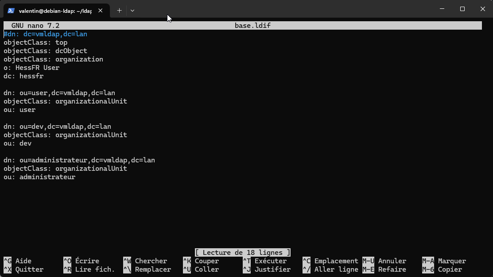

# Changer les dépôts de votre ancienne distribution Ubuntu

Si vous utilisez une ancienne version de Ubuntu et que vous souhaitez mettre à jour les dépôts pour installer un logiciel, vous risquez d'avoir ce genre de message:

.png>)

Il faut donc que vous modifier les dépots pour qu'il se synchronise avec les dépôts spécialement conçu pour les anciennes version de Ubuntu !

Ouvrer un terminal, et taper `sudo nano /etc/apt/source.list` , il devrait vous ouvrir le fichiers des sources avec nano.

Appuyer simultanément sur `ctrl + w` puis `ctrl + r`&#x20;

Puis dans le texte à remplacer, mettez le dépôt actuelle (ici fr.archive.ubuntu.com ici)

.png>)

Puis le dépôt old-releases (old-releases.ubuntu.com)

.png>)

Et remplacer toute les occurences.

Faire de même avec security.ubuntu.com

.png>)

.png>)

Et voila ! Vous avez maintentant une machine qui peut installer des logiciels et ce mettre a jour !&#x20;

.png>)\
.png>)
